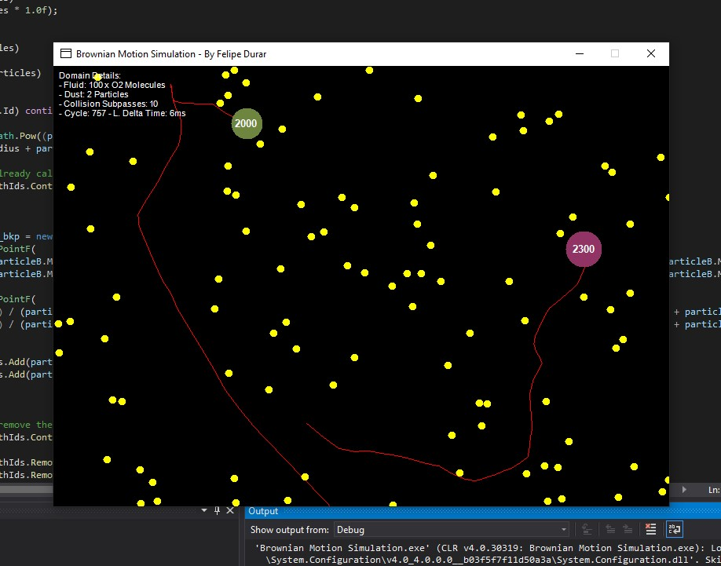
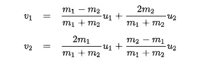
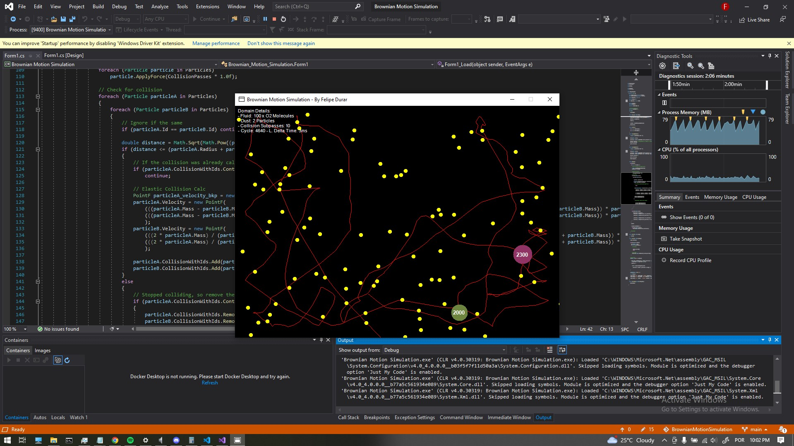

# Brownian Motion Simulation
Brownian Motion Simulation

# What is the Brownian Motion?
Brownian motion, or pedesis, is the random motion of particles suspended in a medium (a liquid or a gas).

Source: https://www.feynmanlectures.caltech.edu/I_41.html

# Gases and the kinetic molecular theory
The kinetic-molecular theory of gases can be stated as four postulates:
- A gas consists of molecules in constant random motion.
- Gas molecules influence each other only by collision; they exert no other forces on each other.   They do not stick to each other.
- All collisions between gas molecules are perfectly elastic; all kinetic energy is conserved.
- The volume actually occupied by the molecules of a gas is negligibly small; the vast majority of the volume of the gas is empty space through which the gas molecules are moving.

Source: https://web.fscj.edu/Milczanowski/psc/lect/Ch4/slide9.htm

# Elastic Collision Model
The equation used to solve the resultant velocities of the collisions between the molecules is the One-dimensional Newtonian's elastic collision equation expressed by:

This way both momentum and kinetic energy are conserved just as the third postulate of kinetic molecular theory describes.

# Collision Detection
The collision detection is realized by checking discrete points on the space, since the particles are very small and their speed used to be quite fast my easiest approach for solving this issue was by subdividing the line segment between every movement and checking the physics for every subdivision.
An enhancemant would be using a better CCD (Continuous Collision Detection) algorithm for better performance.
There is only one kind of collision detection that is Circle-Circle detection by calculating the distance between their centers and checking if the distance is less than the sum of both cicle's radius.

# How to Run it?

The simplest way is by opening the Visual Studio Solution and clicking on Start, or for better performance you can choose the Release target, build the solution and open the executable file.

# Features
- Path Record of the Dust Particles
...

## License

MIT License

Copyright (c) 2022 Felipe Durar

Permission is hereby granted, free of charge, to any person obtaining a copy
of this software and associated documentation files (the "Software"), to deal
in the Software without restriction, including without limitation the rights
to use, copy, modify, merge, publish, distribute, sublicense, and/or sell
copies of the Software, and to permit persons to whom the Software is
furnished to do so, subject to the following conditions:

The above copyright notice and this permission notice shall be included in all
copies or substantial portions of the Software.

THE SOFTWARE IS PROVIDED "AS IS", WITHOUT WARRANTY OF ANY KIND, EXPRESS OR
IMPLIED, INCLUDING BUT NOT LIMITED TO THE WARRANTIES OF MERCHANTABILITY,
FITNESS FOR A PARTICULAR PURPOSE AND NONINFRINGEMENT. IN NO EVENT SHALL THE
AUTHORS OR COPYRIGHT HOLDERS BE LIABLE FOR ANY CLAIM, DAMAGES OR OTHER
LIABILITY, WHETHER IN AN ACTION OF CONTRACT, TORT OR OTHERWISE, ARISING FROM,
OUT OF OR IN CONNECTION WITH THE SOFTWARE OR THE USE OR OTHER DEALINGS IN THE
SOFTWARE.
